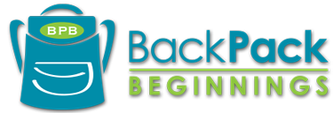

# [Backpack Beginnings](https://backpackbeginnings.org/) Data Analysis Project

**Business Context:**  
Backpack Beginnings is a nonprofit organization in Greensboro, North Carolina dedicated to solving the problem of childhood food insecurity in its home county of Guilford County, NC. Its main program is the Food Backpack program, where Backpack Beginnings partners with several Guilford County schools to provide qualifying students with backpacks full of food to take home for weekends and other extended breaks when school cafeterias are not available. The students consume the food at home, and then bring their empty backpacks back to school afterwards, to be replenished again before the next weekend or other break from school.

**Objective:**  
Backpack Beginnings has expressed interest in expanding its services to more Guilford County schools. This project analyzes two years of Guilford County public schools data (Backpack Beginnings internal data, combined with demographics data from the district offices of the Guilford County Schools public school system and the State of North Carolina Department of Public Instruction) to create a regression model for predicting the food-insecurity need of Guilford County public schools not currently receiving Backpack Beginnings services. These predictions would then be used to rank the schools from most-food-insecure to least-food-insecure. The schools with the highest ranks (meaning, the schools predicted by the model to have the most food-insecure student populations) would then be strongly recommended to Backpack Beginnings for priority in their expansion efforts.

**Solution:**
* The full report of the analysis and its findings, as presented to the Department of Mathematics faculty at North Carolina Agricultural & Technical State University, can be viewed [here](solution/Black,%20D.%20-%20Investigating%20the%20Current%20Trend%20and%20Predicting%20the%20Future%20Needs%20for%20BackPack%20Programs%20-%20BackPack%20Beginnings%20in%20Guilford%20County,%20North%20Carolina.pdf). (*Internal data from Backpack Beginnings has been omitted for privacy.*) 
* A shortened version of the report was made for presentation and publication at the 2019 International Conference on Data Science in Las Vegas, NV, and can be viewed [here](https://par.nsf.gov/servlets/purl/10108840). 
* The original data analysis script, created in RStudio, can be found [here](solution/NRT%20research.R).
